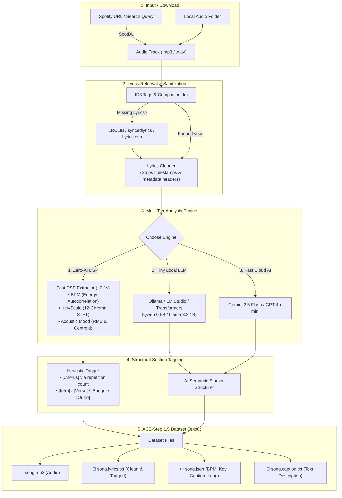

# 🎵 SpotDL Lyrics & LoRA Dataset Preparation

[](https://opensource.org/licenses/MIT)
[](https://www.python.org/downloads/)
[](https://github.com/astral-sh/uv)

Automated toolkit to download tracks via **SpotDL**, clean and format timestamp-free lyrics, and extract musical metadata (**BPM, Key/Scale, Time Signature, Section Structure, and Captions**) specifically formatted for **ACE-Step 1.5 LoRA training**.

---

## 🏛️ System Architecture

The toolkit operates as a modular, 5-stage pipeline designed for speed, flexibility, and offline privacy:



---

## 🧠 Easy-to-Understand Component Breakdown

Here is what happens under the hood in plain terms:

| Step | Component | Plain English Explanation |
| :--- | :--- | :--- |
| **1. Audio Ingestion** | `spotdl_downloader` | Takes Spotify links, playlists, or local folders and ensures you have high-quality audio files ready on disk. |
| **2. Lyrics Sanitizer** | `lyrics_cleaner` & `lyrics_providers` | Finds the song's lyrics (from ID3 tags, local `.lrc`, or free online lyrics APIs) and wipes away messy timestamps like `[01:23.45]` and metadata headers. |
| **3. Audio Feature Detection** | `audio_analyzer` & `language_detector` | Listens to the song's audio mathematically in **0.1s** to calculate exact **BPM tempo**, **musical key** (e.g. *B major*), **energy level**, and detects song language. |
| **4. Section Structurer** | `lyrics_structurer` & `ai_annotator` | Turns plain lyrics walls into organized sections (`[Intro]`, `[Verse 1]`, `[Chorus]`, `[Bridge]`, `[Outro]`) using either local pattern repetition or a tiny AI model. |
| **5. Caption & Metadata Packaging** | `caption_generator` & `dataset_validator` | Generates diffusion training captions and `.json` metadata pairs, then audits the entire dataset to ensure 100% training readiness. |

---

## ⚡ Multi-Tier Modes Comparison

| Mode | Engine | Speed | Requirements | Best For |
| :--- | :--- | :--- | :--- | :--- |
| **Zero-AI Mode** | DSP Signal Analysis | **~0.1s / song** | **100% offline & free** | Maximum speed, zero API keys, batch processing large libraries |
| **Tiny Local AI** | Ollama / LM Studio / Transformers (`qwen2.5:0.5b`, `llama3.2:1b`) | **~0.5s / song** | **100% offline & local** (Zero API keys) | Privacy-first AI structural tagging & rich captions with < 1GB RAM |
| **Fast Cloud AI** | Gemini 2.5 Flash / GPT-4o-mini | **~1.5s / song** | `GEMINI_API_KEY` or `OPENAI_API_KEY` | Studio-grade diffusion captions and deep subgenre understanding |

---

## 📦 Installation

Using [`uv`](https://docs.astral.sh/uv/) (Recommended):

```bash
# Clone the repository
git clone https://github.com/yuriolive/spotdl-lyrics-lora.git
cd spotdl-lyrics-lora

# Install dependencies
uv sync
```

Or with standard `pip`:

```bash
pip install -e .
```

*Note: Ensure `ffmpeg` is installed on your system if you plan to download audio files with SpotDL.*

---

## 🚀 Quick Start

### 1. Zero-AI Mode (Fastest, 100% Local & Free)
Process an existing directory of audio files (`.mp3`, `.wav`, `.flac`, `.ogg`, `.opus`, `.m4a`):

```bash
uv run spotdl-lora --dir ./my_music --auto-analyze --structure-lyrics --overwrite
```

### 2. Tiny Local Model (Ollama / Local LLM)
Structure lyrics into `[Verse]`/`[Chorus]` and generate descriptions using a tiny local model:

```bash
# 1. Run Ollama model: ollama run qwen2.5:0.5b
# 2. Run spotdl-lora:
uv run spotdl-lora --dir ./my_music --use-ai --ai-provider ollama --local-model qwen2.5:0.5b --overwrite
```

### 3. Fast Cloud AI Mode (Gemini Flash / OpenAI)
```bash
export GEMINI_API_KEY="your-api-key"
uv run spotdl-lora --dir ./my_music --use-ai --ai-provider gemini --overwrite
```

### 4. Download from Spotify & Prepare Dataset
Download a Spotify playlist and generate clean `.lyrics.txt` + `.json` annotations in one step:

```bash
uv run spotdl-lora --download "https://open.spotify.com/playlist/..." --output ./dataset --auto-analyze
```

### 5. Validate Dataset Readiness
Verify that all audio files have matching, clean lyrics and valid metadata:

```bash
uv run spotdl-lora --validate ./my_music
```

---

## 📋 Generated File Structure

Each audio track is paired with ACE-Step 1.5 compliant training files:

```
dataset/
├── song1.mp3               # Audio track
├── song1.lyrics.txt        # Clean lyrics with [Intro], [Verse], [Chorus] tags
├── song1.json              # Annotations (BPM, Key, Caption, Language)
└── song1.caption.txt       # Natural language description
```

#### Example `song1.json`:
```json
{
    "caption": "A high-energy, fast-paced, punchy, high-energy Brazilian funk track in G minor at 143 BPM performed by Anitta/PEDRO SAMPAIO, titled 'NO CHÃO NOVINHA', featuring Portuguese vocals.",
    "bpm": 143,
    "keyscale": "G minor",
    "timesignature": "4",
    "language": "pt"
}
```

#### Example `song1.lyrics.txt`:
```txt
[Verse 1]
Look at what you cannot have
Boss bitch, mulher mala, mala
Encuéntrame en el trópico
Por los lados de Punta Cana

[Chorus]
Estoy en roce, sin pose
Hoy yo pago to'
Y después de las doce
A mí me gusta to'

[Outro]
Sá-sá-sácala, tómala
Sá-sá-sá-sá-sá-sá
```

---

## 💻 Python Library Usage

```python
from spotdl_lyrics_lora import (
    process_folder,
    process_audio_file,
    download_and_prepare,
    analyze_audio_features,
    validate_dataset_folder,
)

# 1. Process all songs with Zero-AI DSP
created = process_folder("./funk-pop", auto_analyze=True, structure_tags=True, overwrite=True)

# 2. Process with local Ollama model
created = process_folder("./funk-pop", use_ai=True, ai_provider="ollama", local_model="qwen2.5:0.5b", overwrite=True)

# 3. Extract acoustic DSP features directly (< 0.2s)
features = analyze_audio_features("./funk-pop/track.mp3")
print(features)
# {'bpm': 136, 'keyscale': 'B major', 'timesignature': '4', 'mood_tags': ['punchy, high-energy']}

# 4. Download and prepare from Spotify
download_and_prepare("https://open.spotify.com/track/...", output_dir="./dataset", auto_analyze=True)
```

---

## 🛠️ CLI Options Reference

| Flag | Description | Default |
| :--- | :--- | :--- |
| `-d, --dir` | Directory containing audio files to process | `None` |
| `-f, --file` | Path to a single audio file to process | `None` |
| `--download` | Spotify URL (track, album, playlist) or search query | `None` |
| `-o, --output` | Destination directory for output files | Same as audio |
| `--auto-analyze` | Zero-AI detection of BPM, Key, Time Signature, and Captions | `False` |
| `--structure-lyrics` | Automatically insert `[Intro]`, `[Verse]`, `[Chorus]`, `[Outro]` tags | `False` |
| `--use-ai` | Use AI model for section tagging & captions | `False` |
| `--ai-provider` | AI provider (`ollama`, `local`, `transformers`, `gemini`, `openai`, `openrouter`) | `auto` |
| `--local-model` | Local model name (e.g. `qwen2.5:0.5b`, `llama3.2:1b`) | `qwen2.5:0.5b` |
| `--local-url` | Local server URL (e.g. `http://localhost:11434`, `http://localhost:1234/v1`) | `http://localhost:11434` |
| `--json` | Generate `.json` & `.caption.txt` metadata files | `False` |
| `--overwrite` | Overwrite existing output files | `False` |
| `--format` | Audio format for downloads (`mp3`, `flac`, `wav`, `opus`) | `mp3` |
| `--validate` | Run validation audit on a dataset directory | `None` |

---

## 🧪 Running Tests

```bash
uv run python -m unittest discover -s tests -p "*_test.py"
```

---

## 📄 License

MIT License. See [LICENSE](LICENSE) for details.
